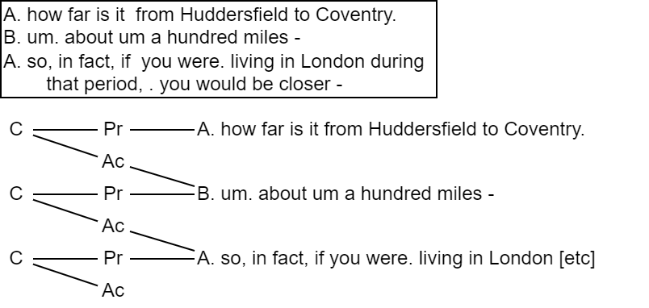
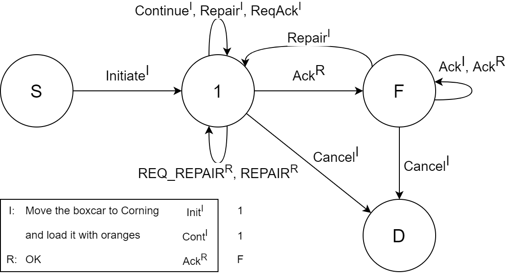

# 基盤化の計算モデル

## 隣接ペア

［質問-返答］［誘い-受諾］のような最も基本的な相互行為を達成する発話対のことであり，以下のような2つの発話X，Yの連続である(Schegloff & Sacks, 1973)．

隣接ペアは以下のような2つの発話X，Yの連続である．

1. XとYは隣接した位置にある
2. XとYは異なる話者が産出する
3. 第1部分Xは，第2部分Yに先行する
4. XはYを特定化する（Xは決まった型のYを要求する）

## Clark による定式化

> * C: 行くの？
> * N: えっ?
> * C: 行くの?
> * N: うん
>
> (出典: ザトラウスキー，1993)

Clark(1996)は，以下の原則が対話内で行われていることを定式化した．

> 共同行為に従事する主体たちは，当面の目的に十分な範囲で，それに成功したという共通基盤（相互信念）を形成しようとする．

このような共通基盤を形成することを **基盤化(grounding)** とよぶ．
基盤化のためには，共通基盤の定義を満たす共有基礎 $b$ が必要である．
発話例では，第4ターンのNの応答が（質問に対する適切な応答になっているという意味で）Cの質問を理解したという証拠を示しており，これが共有基礎の役割を果たしている．

聞き手によって正しく理解された発話のことを談話への **貢献(contribution)** とよび，貢献は **提示(presentation)** と **受理(acceptance)** の2段階からなるとしている．

> 提示: AがBに発話 $u$ を提示する．Aは，Bからある証拠 $e$ が示されれば，$u$ によって自分が意味したことがBに理解されたと信じて良い，という仮定に基づいている．
>
> 受理: $u$ によってAが意味したことを理解したという証拠 $e'$ を示すことで，Bが $u$ を受理する．Bは，一旦 $e'$ がAによって記録されれば，自分の理解をAも信じるようになる，という仮定に基づいている．

そして，Bによって示されるような理解の証拠(Clark, 1996)としては下表の4つのタイプがある．

|理解の証拠||
|:--|:--|
|主張 (assertion)|うなづいたり，「うん」「はい」の類のあいづちを打つ|
|前提 (presupposition)|要求された応答を産出したり，関連する次のターンを開始したりする|
|表示 (dispaly)|特定の型の応答を産出することで，A の発話をどのようなものとして理解したか示す|
|例示 (examplification)|A の発話の全体あるいは一部の言い換え・復唱を行ったり， しかめっつら・失望の表情を見せる|

発話例におけるNの第2ターンのような問い返しや明確化を求める質問は，逆に不理解の証拠になる．
不理解が生じるとそれを修復するやりとりが開始され，理解の証拠のいずれかが示されることで，受理段階が終了する．

### 貢献グラフ

貢献は提示と受理の2つの段階からなる．
受理過程は，しばしば複数のターンを必要とするが，ある貢献に対する受理はそれ自体が新たな貢献の提示でもある．
このような基盤化の過程は以下のようにグラフ構造で表すことができ，これを **貢献グラフ(contribution graph)** とよぶ(Clark & Schaefer, 1989)．

上記グラフにおける `B. um. about um a hundred miles - ` は，直前の受理でありながら，次の隣接ペアへの提示を示す形となる．

また，会話分析における隣接ペアや談話分析の発話交換構造は，貢献を基礎とした構造とみなすことができ，カーンとブレナンはこのような観点から貢献グラフと隣接ペアを融合する見方をしている(Cahn & Brennan, 1999)．

## Traum による定式化

対話の各時点において現在の貢献の基盤化がどの段階にあるかということが明示されていない．
Traum(Traum, 1994, 1999; Traum & Allen, 1992; Traum & Hinkelman, 1992)はこの点が，Clarkのモデルの最大の欠点であるとし，提示・受理という大雑把な2段階からなる貢献に代わって，開始・続行・認定などの新たな新たな対話の定式化を提唱した．

### 談話ユニットと基盤化アクト

**談話ユニット(discourse unit, DU)** は，基盤化の理論における貢献に対応するもので，1つの発話が提示されてから，その発話の理解が主体たちの共通基盤になるまでの範囲を指す．
談話ユニットは，対話中の発話を何らかの形で分割した基本単位に付与される，**基盤化アクト(grounding act)** の列からなる．
そのような単位としては，イントネーション句(Pierrehumbert & Hirschberg, 1990)やそれに加えて長い休止句で区切られた単位(Traum & Heeman, 1996)がしばしば用いられる．

Traumのモデル(Traum, 1994)では，現在の貢献の基盤化に関する主体のその時点での内部状態と，現在の発話によって与えられた基盤化アクトから，次の状態を決定するような遷移ネットワークによって，基盤化過程をモデル化する．
これによって，各時点での基盤化の状態が明示され，また，次に来るべき基盤化アクトの予測が可能になる．

Traum & Nakatani(1999) を修正した基盤化アクトを表として示すと以下のようになる．

|基盤化アクト||
|:--|:--|
|開始 (Initiate)|新しい談話ユニットを生成する|
|続行 (Continune)|同一主体が現在処理中の談話ユニットに関連する内容を追加する|
|認定 (Ack)|他者によって提示された直前の発話に対する理解を示す|
|修復 (Repair)|談話ユニットの内容の誤解 (の可能性) を解消する|
|修復要求 (ReqRepair)|他者からの修復を求める|
|認定要求 (ReqAck)|他者からの認定を求める|
|取り消し (Cancel)|現在の対話ユニットの処理を停止し，基盤化不可能なものとする|

## 参考

### 文献

* 石崎 雅人, 伝 康. (2001). 談話と対話. 日本: 東京大学出版会. 第7章 相互信念と対話

### 論文

<!-- * Clark(1996) -->
* Clark, H. H. (1996). Using Language. イギリス: Cambridge University Press.
<!-- * Clark & Schaefer, 1989 -->
* Clark, H. H., & Schaefer, E. F. (1989). Contributing to discourse. Cognitive science, 13(2), 259-294.
<!-- * Cahn & Brennan, 1999 -->
* Cahn, J. E., & Brennan, S. E. (1999, November). A psychological model of grounding and repair in dialog. In Proc. Fall 1999 AAAI Symposium on Psychological Models of Communication in Collaborative Systems.
<!-- * Traum, 1994 -->
* Traum, D. (1994). A computational theory of grounding in natural language conversation.
<!-- * Traum, 1999 -->
* Traum, D. R. (1999, November). Computational models of grounding in collaborative systems. In Psychological Models of Communication in Collaborative Systems-Papers from the AAAI Fall Symposium (pp. 124-131).
<!-- * Traum & Allen, 1992 -->
* Traum, D. R. & Allen, J. F.(1992). A speech acts approach to grounding in conversation. In Proceedings of International Conference on Spoken Language Processing (ICSLP'92) (pp. 137-140).
<!-- * Traum & Hinkelman, 1992 -->
* Traum, D. R., & Hinkelman, E. A. (1992). Conversation acts in task‐oriented spoken dialogue. Computational intelligence, 8(3), 575-599.
<!-- * Pierrehumbert & Hirschberg, 1990 -->
* Pierrehumbert, J., & Hirschberg, J. B. (1990). The meaning of intonational contours in the interpretation of discourse.
<!-- * Traum & Heeman, 1997 -->
* Traum, D. R., & Heeman, P. A. (1996, October). Utterance units and grounding in spoken dialogue. In Proceeding of Fourth International Conference on Spoken Language Processing. ICSLP'96 (Vol. 3, pp. 1884-1887). IEEE.
<!-- * Traum & Nakatani, 1999 -->
* Traum, D., & Nakatani, C. H. (1999). A two-level approach to coding dialogue for discourse structure: activities of the 1998 dri working group on higher-level structures. In Towards Standards and Tools for Discourse Tagging.

(文責) 竹内研究室 天谷武琉
